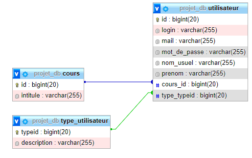

# README.md

# Structure du projet

Le projet SPRING est bâti sur un pattern Controller-Service-Repository, un pattern répendu dans les applications SPRING.

# Peuplement de la BDD

Le fichier ressources/data.sql contient une série d’insertion en base pour tester l’API,
pour les tables type_utilisateur, utilisateur et cours.

# Transfert d’objets entre processus

Le projet utilise des DTOs (Data Transfert Object) pour faciliter la communication de données entre plusieurs systèmes. Les couches de Service possèdent des méthodes de convertions entre objet de classe et DTOs.

# Model de la base de données utilisée

